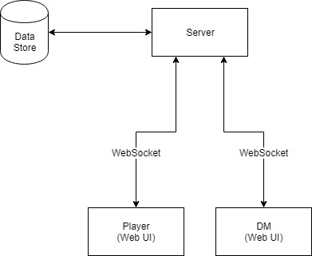

# DND Player

## Features / Functionality
- SRD/5e specific
- Chat
- Parametric character sheets
- Data import/export
  - Characters
  - Monsters
- Collaborative whiteboard
  - Maps
  - Drawing
  - Images
  - Distance measurement / grid
  - Character tokens with critical data exposed
    - HP / Max HP
    - AC
    - Status effects / buffs
    - Altitude?
  - Initiative tracker
    - Character name
    - HP / Max HP
    - AC
    - Initiative roll
    - Status effects / buffs
  - 3 whiteboard layers
    - Background
    - Character
    - DM only
- Quick dice rolling
  - Ability to roll custom dice
  - Advantage/Disadvantage
  - Roll for specific ability / spell
  - Secret DM rolls
- Try to use external API's where possible for data or calculations

## Plans

Functionality over form - I.E. get something working before making it nice to look at or nice to use.

## Architecture

- Could it be serverless?
  - Where would data be stored?
    - DM's local storage?
- If a server was required, what would be the bare minimum it could do?
  - Prefer client side calculations etc (e.g. Dice rolls) as DND is a game of trust anyway so no point worrying about fudged rolls etc.
- Could it run on something like Firebase, so that the effort of synching clients and saving data is offloaded to a third party?
  - Cost?
  - Would this actually provide the functionality we need I.E. would we still need some kind of WebSocket server to handle the real-time bits I.E. Whiteboarding / Chat or does Firebase provide this feature.
  - [Firebase Spark](https://firebase.google.com/pricing/) plan is free, the [RealtimeDatabase](https://firebase.google.com/products/realtime-database/) offering grants 1GB data, and 100 simultaneous connections.
  - This seems like it would take a lot of the legwork out of it?
  - Each 'party' would need to set up their own firebase account; probably not an insurmountable issue
- If we support image uploading to display on whiteboard / maps how is this policed ?
  - If the images are actually uploaded and stored somewhere then we not only need to provide that storage but also presumably need to somehow prevent mis-use.
  - If images that are used are just stored in local storage and treat the DM's machine as the primary store. The downside of this is the same as the above point, where the DM's machine (which should be considered volatile) is now critical and could quite easily loose important data.

### Data

#### Backend Data requirements

- Character sheets
- Chat history

## Todo

[DONE] Create initial CRA application

## Links / Notes
